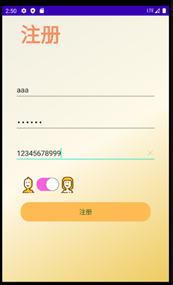
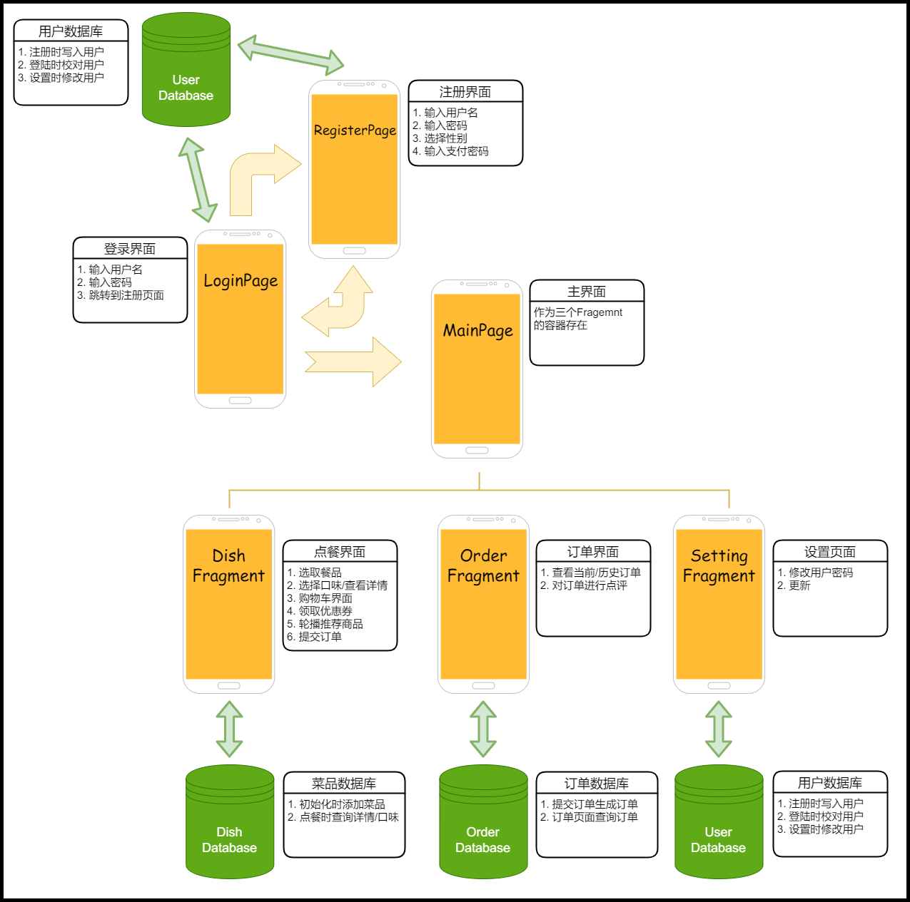
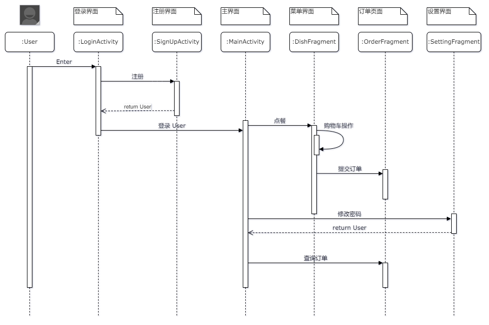
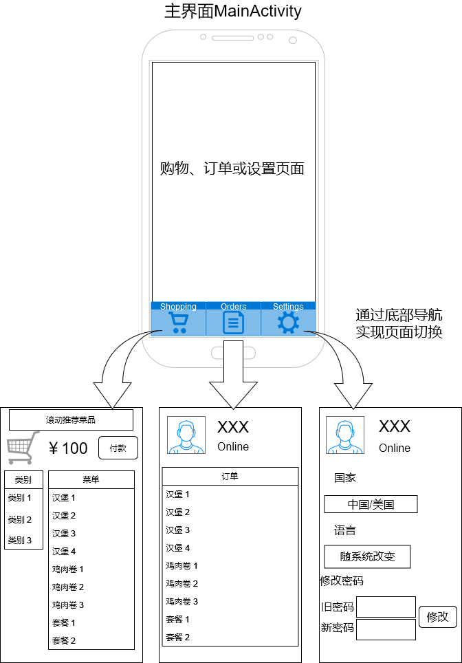
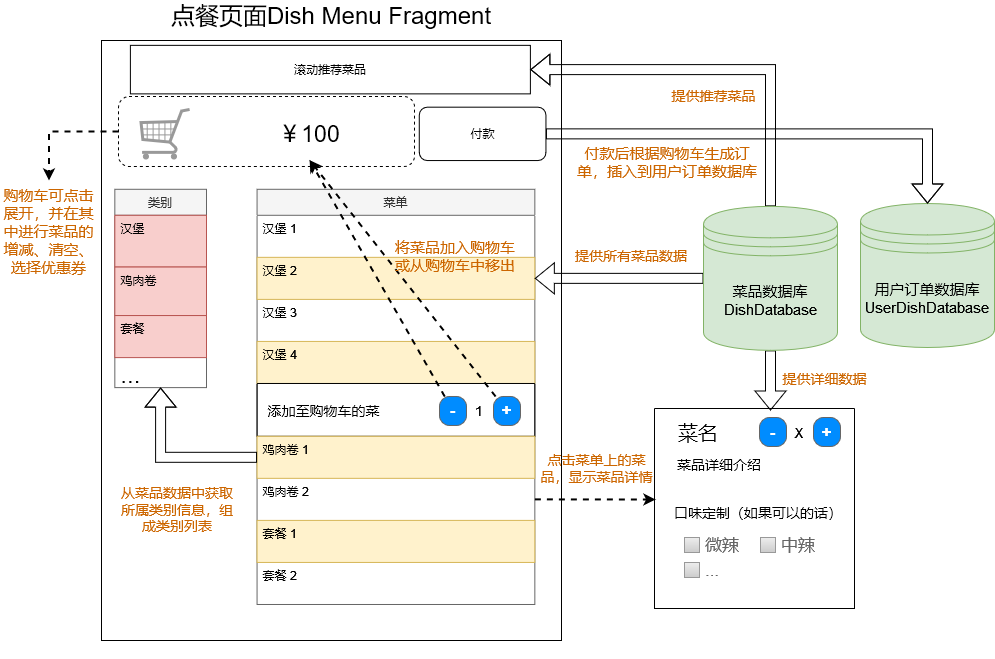
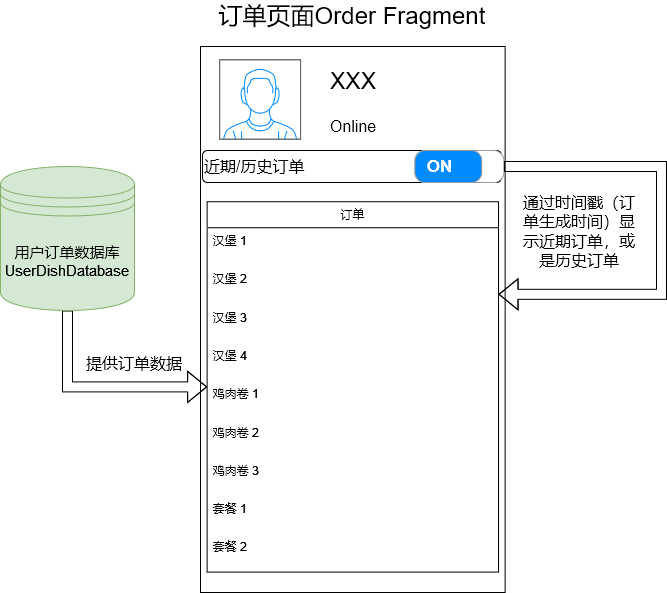
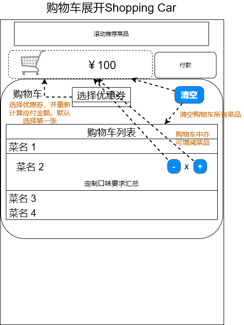

# Order Food

安卓大作业“点餐”系统（单机版）

“点餐”系统，是信息时代的应用平台。用一部智能机，就能完成以前PC才能完成的各种点餐任务，方便快捷，应用广泛。本课题要求实现简单的“点餐”系统功能

1.  显示欢迎界面后，进入主界面

2. 主界面支持对菜的**分类**（可网上查询资料自定义，菜建议使用图片显示），支持特色菜**推荐滚动显示**，支持**套餐功能**

3. 顾客可以选择**具体菜、份量打勾确定**，待顾客所有菜选择确认后，提交**生成订单**

4. 支持对具体菜的类似麻辣、微辣等酸辣苦甜**定制需求**

5. 需**输出顾客订单总价和菜单详细清单**

6. 支持**优惠券**打折功能

7. 功能扩展（登录、修改密码、语言随系统切换等）

    ## 项目预览

    

    ## 项目流程

    ### 总流程

    

    ### 总体时序图

## 参考与引用

包括但不仅限于

https://gitee.com/FranzLiszt1847/OrderOnline

https://github.com/Rahmouni-Seif-BI/Android-APP-Seif-Delivery-Food

[安卓技术中台](https://github.com/getActivity/AndroidProject)

[带头部的RecycleView，StickyListHeaders](https://github.com/emilsjolander/StickyListHeaders)

[轮播图，banner](https://github.com/youth5201314/banner)

### Utils

包括但不仅限于

1. `KeyboardUtils`软键盘收起
2. `RegexEditText` 轮子哥的自定义输入框上级接口
3. `PasswordEditText`轮子哥的密码输入框
4. `ClearEditText`轮子哥的清空按钮输入框
5. `SubmitButton`轮子哥的带动画提交按钮
6. `SwitchButton`轮子哥的仿IOS开关